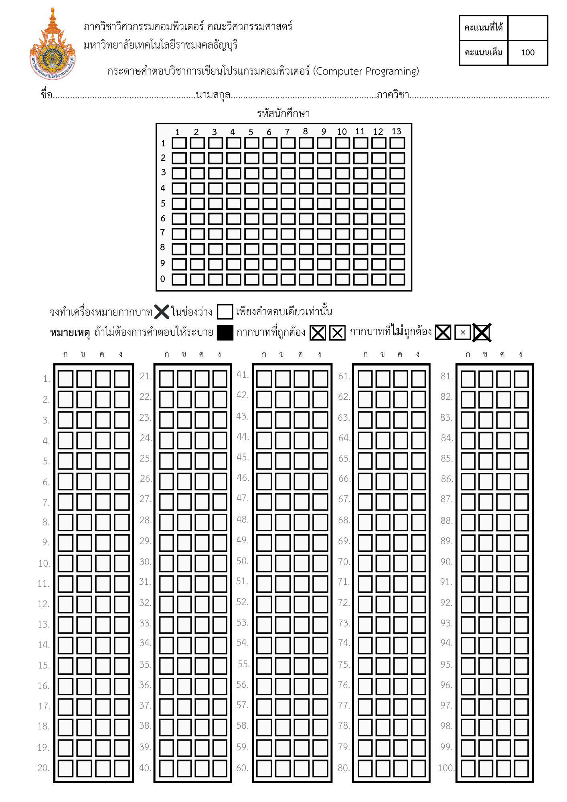
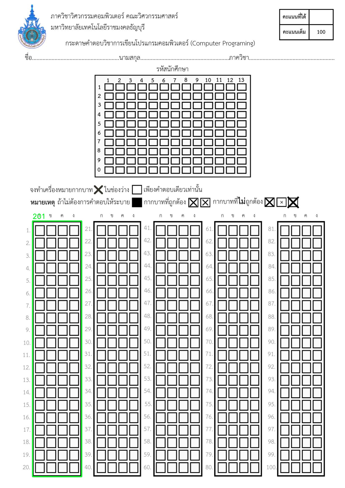
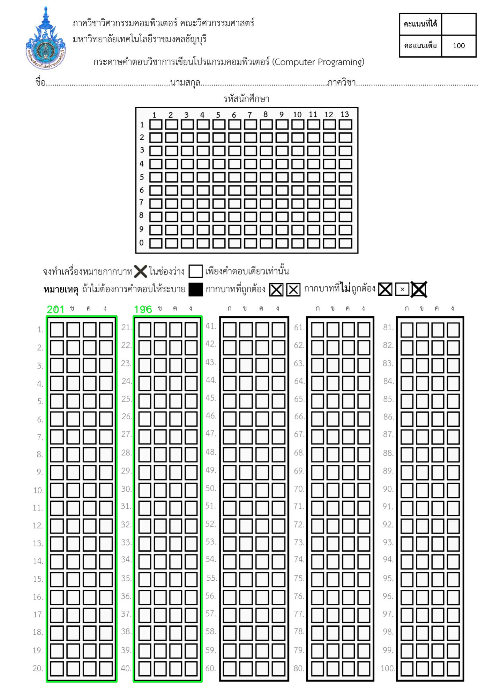
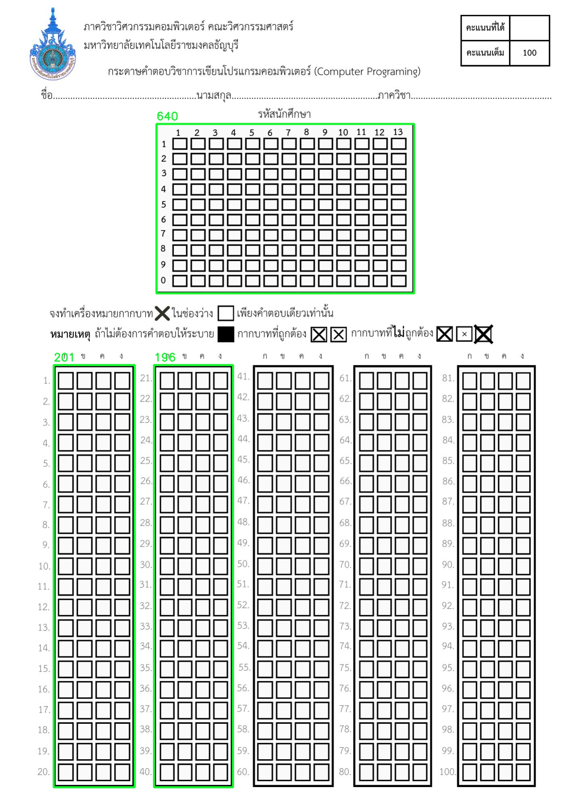
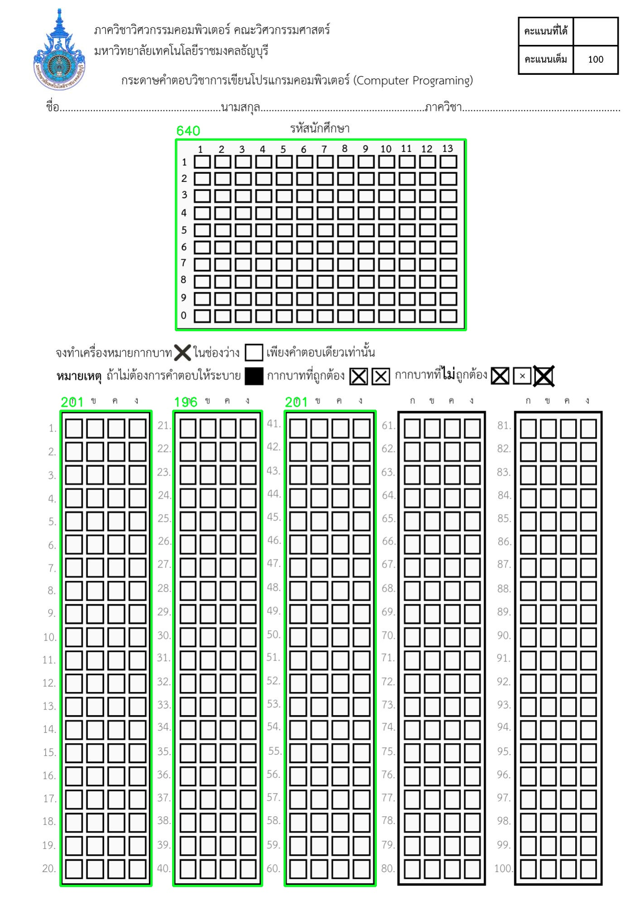
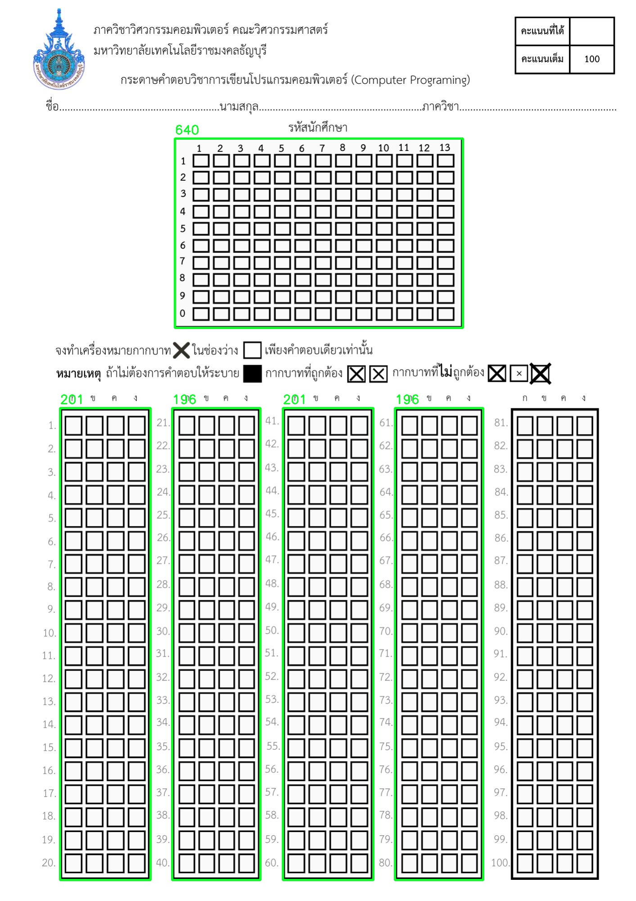
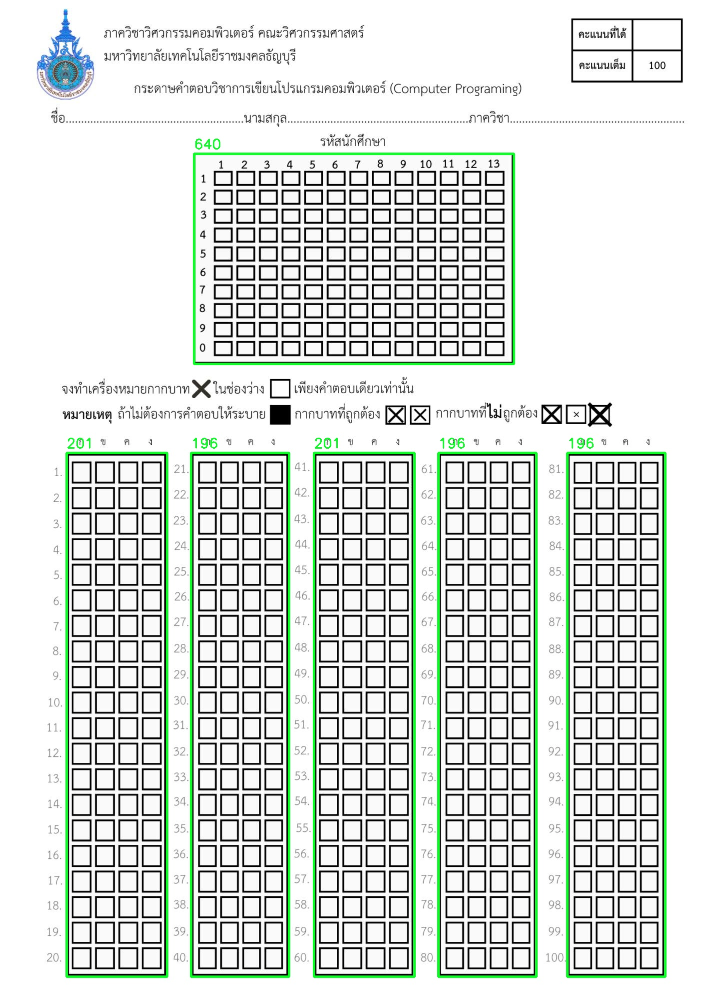
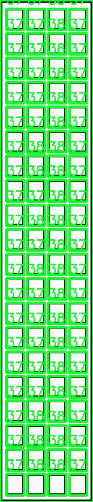

<h1>Set Up (Python 3.10.11)</h1>

virtualenv env (if you use env)

env\Scripts\activate (if you use env)

pip install -r requirements.txt

fastapi dev main\server.py (start server)

<h1>APIs</h1>

|  Method | Endpoint   |      Description      |  Body |
|----------|----------|:-------------:|------:|
|GET| / |  Check Healty Service | - |
|GET| /mock_response |    Get Example Response   |   - |
|POST| /predict | Execute OMR |   file:{image-path} |

<h1>Images</h1>

Origin Image File


Processing Scaning using sort_contours method ("left-to-right")







Scaning Answer Box for each section



And then finding answer (count the number of non-zero pixels in the box area) and append choice to array list 

```
for (j, c) in enumerate(cnts):
            # construct a mask that reveals only the current
            # "box" for the question
            mask = np.zeros(thresh.shape, dtype="uint8")
            cv2.drawContours(mask, [c], -1, 255, -1)
            
            # apply the mask to the thresholded image, then
            # count the number of non-zero pixels in the
            # box area
            mask = cv2.bitwise_and(thresh, thresh, mask=mask)
            total = cv2.countNonZero(mask)
            
            # if the current total has a larger number of total
            # non-zero pixels, then we are examining the currently
            # bubbled-in answer

            if answer is None and total > 800:
                answer = (q+1 + (0 if section == 1 else (section * 20) - 20),get_answer_notation(j+1))
                
            elif answer is not None and total > 800 : 
                answer = (q+1 + (0 if section == 1 else (section * 20) - 20),None) 
            
            if j+1 == 4 and answer is None:
                answer = (q+1 + (0 if section == 1 else (section * 20) - 20),None) 

        sectionList.append(answer)
```

```
def get_answer_notation(value):
     return {
        1: 'ก',
        2: 'ข',
        3: 'ค',
        4: 'ง',
    }.get(value, None)  
```

Response

```json
{
    "id": "1161104620611",
    "answer": [
        {
            "no": 1,
            "answer": "ก"
        },
        {
            "no": 2,
            "answer": "ข"
        },
        {
            "no": 3,
            "answer": null
        },
        {
            "no": 4,
            "answer": null
        },
        {
            "no": 5,
            "answer": "ก"
        },
        {
            "no": 6,
            "answer": "ก"
        },
        {
            "no": 7,
            "answer": null
        },
        {
            "no": 8,
            "answer": null
        },
        {
            "no": 9,
            "answer": null
        },
        {
            "no": 10,
            "answer": null
        },
        {
            "no": 11,
            "answer": null
        },
        {
            "no": 12,
            "answer": null
        },
        {
            "no": 13,
            "answer": null
        },
        {
            "no": 14,
            "answer": null
        },
        {
            "no": 15,
            "answer": null
        },
        {
            "no": 16,
            "answer": null
        },
        {
            "no": 17,
            "answer": null
        },
        {
            "no": 18,
            "answer": null
        },
        {
            "no": 19,
            "answer": null
        },
        {
            "no": 20,
            "answer": null
        },
        {
            "no": 21,
            "answer": null
        },
        {
            "no": 22,
            "answer": null
        },
        {
            "no": 23,
            "answer": null
        },
        {
            "no": 24,
            "answer": null
        },
        {
            "no": 25,
            "answer": null
        },
        {
            "no": 26,
            "answer": null
        },
        {
            "no": 27,
            "answer": null
        },
        {
            "no": 28,
            "answer": null
        },
        {
            "no": 29,
            "answer": null
        },
        {
            "no": 30,
            "answer": null
        },
        {
            "no": 31,
            "answer": null
        },
        {
            "no": 32,
            "answer": null
        },
        {
            "no": 33,
            "answer": null
        },
        {
            "no": 34,
            "answer": null
        },
        {
            "no": 35,
            "answer": null
        },
        {
            "no": 36,
            "answer": null
        },
        {
            "no": 37,
            "answer": null
        },
        {
            "no": 38,
            "answer": null
        },
        {
            "no": 39,
            "answer": null
        },
        {
            "no": 40,
            "answer": null
        }
    ],
    "headers": {
        "content-disposition": "form-data; name=\"file\"; filename=\"Computer_Programing_t2.png\"",
        "content-type": "image/png"
    },
    "filename": "306d4845-25cb-4e60-9d89-5aee7d40f767.jpg"
}
```